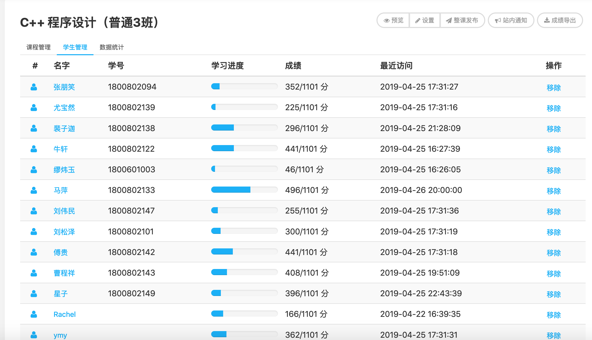
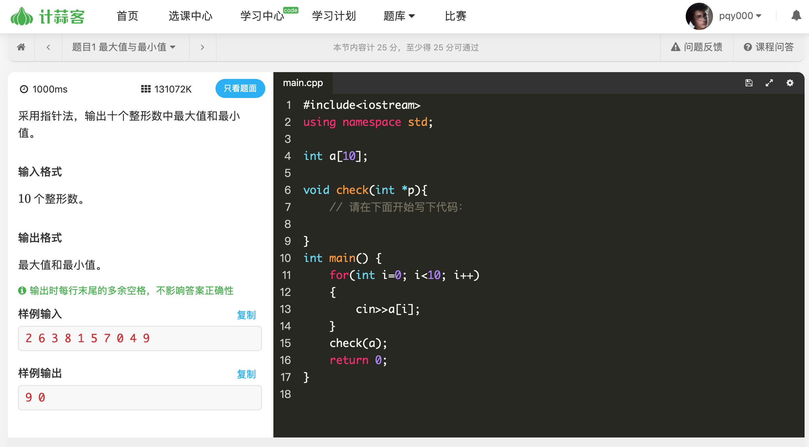
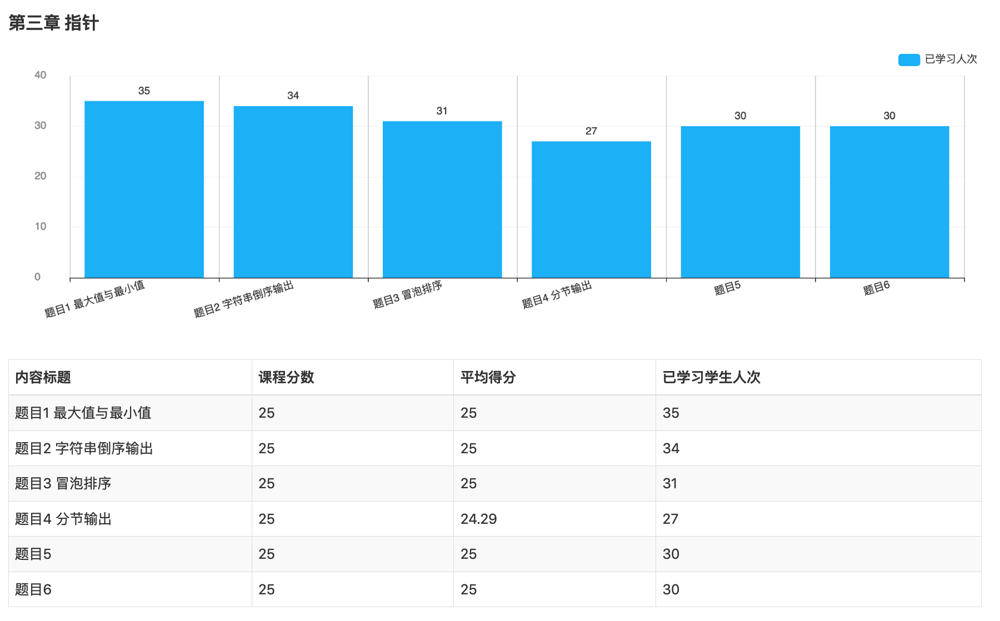
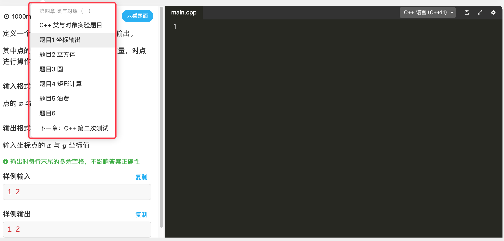
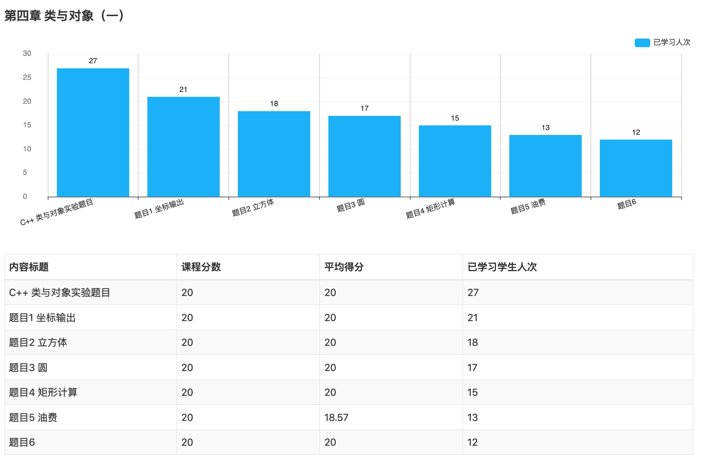
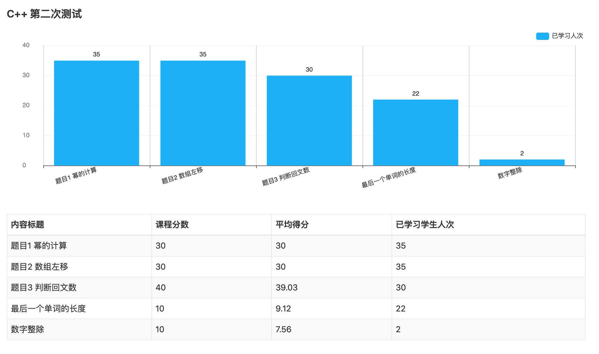

## 4月工作总结

对4月份进行工作总结，回顾本月的工作，让我在各方面得到了锻炼，我将主要从C++课程助理，系统平台课程助教，三江源数据中心的运维三个方面做本月工作的总结。

### C++课程助理

#### 课程内容
本月中4-8周的实验设计内容主要包含以下几部分内容，分为四次实验课进行。

- 类
	- 理解类的内容
	- 掌握类的定义形式
	- 学会定义类的属性和成员函数，掌握类的基本实现及应用
- 面向对象封装性应用
	- 掌握Public, private, protected三个关键字的作用
	- 掌握简单的信息隐藏方法
 
#### 实验形式
针对每部分实验内容，有针对性地出了有关知识点的题目，使18级同学能够有效地掌握C++编程的基本思想，培养用编程语言解决实际问题的能力。

#### 实验平台
每次实验每周设计6道题目，采用[计蒜客平台](https://www.jisuanke.com/)进行在线评测。

##### 分析
查看学生的统计信息，可以发现在采用计蒜客平台之后，大部分学生完成偏低，应该令诸位学生尽快完善之前的章节。从而保证C++学习的效果。

约有65%的学生完成度在30%左右，有3-5名同学完成度接近70%，暂无一名同学全部完成，原因可能是由于之前的一些介绍章节没有及时地学习。不过在我自主出题目后，完成度提升了很多。

### 课程教学分析

接下来将几次实验分几周进行讨论，分为指针，类与对象(一)，C++第二次实验三部分进行展示。

#### 指针实验

##### 实验情况

指针实验分为六道题目，采用程序填空的方式，根据课程进度，分两次完成。共6道题目，每道题目均为25分，在实验课讲解了具体的题目，学生们理解此知识点。

##### 结果统计

经过统计可知，每道题目的学生人数几乎到了100%，平均得分为149.29(满分 150)，不过有3-5位同学的在分节输出和冒泡排序两道题目上未得分，课后单独进行了辅导答疑，使他们能够掌握知识点，对于能够通过大部分用例的学生们，经过钻研，也可以独立完成此编程任务。

#### 类与对象(一)

##### 实验情况

类与对象题目分七道题目，采用程序填空的形式，考察了类的构造函数和析构函数，函数的重载等知识点。根据课程进度，分两次完成。共6道题目，每道题目均为20分，满分140分，在实验课讲解了具体的题目，学生们理解此知识点。

##### 结果统计

学生完成情况总体一般，通过的学生平均得分为108.57分(满分140)分，约有一半的同学得到了满分，一般的同学有1-2到题目没有完成，大约有3名学生未能在课堂上通过3道题目，进行了题目的辅导，使他们利用课余时间完成了学习。

#### C++第二次测试

##### 考试情况

本次考试我在编程三班监考，第二次测试分为五道题目，其中题目1-3是基础题目，分为30分，30分，40分，考虑三班部分同学编程能力较强，能够提前完成这三道题目，我又添加了两道附加题目(均为10分)，作为附加题与奖励分。总分共120分。

##### 成绩分析

对第二次测试成绩进行分析，发现以下几点结果:

- 全部同学通过了前两道题目(总分为60分)
- 有30名同学通过了三道题目(总分为100分)
- 22名同学通过了第一道奖励题目(得分为110分)
- 2名同学通过了第二道奖励题目(得分为120分)

总体分析可知，学生们的完成情况总体呈正态分布，有2-3名能力很强的学生可以完成所有的题目，保证85%以上的学生能够完成基础题目的基础上，尝试做拔高与奖励的题目。说明题目出的难度适合，且能够锻炼学生的能力。

#### 总结
本月共出了类似4次实验，共20道题目，约110个用例，能够方便系内18级同学更好的夯实基础，熟悉内容。将代码上传到github上，链接地址如下：

[https://github.com/pqy000/C-2019/tree/master/Jia](https://github.com/pqy000/C-2019/tree/master/Jia)

### 系统平台课程助教
系统平台课程承担作业批改与实验课答疑的工作。

#### 实验课答疑

| 类型 | 内容 |
| :------| :------: 
| 答疑时间 | 周二下午78节 | 
| 答疑班级 | 171 172班 |
| 学生人次 | 80人 |
| 答疑内容1 | 中断实验 |
| 答疑内容2 | 操作系统的安装与使用 |
| 答疑内容3 | 实验环境的使用 |
| 实验课地点  | 系310与309机房 |

### 三江源数据中心运维

对系内的集群环境进行初步的整理，维护了系内140集群的IP地址，之前22端口被攻击，导致无法通过远程ssh登陆访问，通过修改各节点的配置文件，将端口修改为2222，能够成功访问登陆。

## 总结与未来计划

在C++课程组与系统平台课程组的各位老师帮助指导下，通过自身努力，从初步承担课程助教工作到熟悉工作，逐渐摸清了工作中的基本状况。

### 问题与进展

针对上月遇到的问题找出了一定的解决方案

- 实验卡的难度适中
  - 在4月份所出的几次实验中，题目包括指针操作，类与第二次测试，根据学生实验后所得结果的统计，可以发现难度适合，测试成绩呈正态分布，又几位能力强的同学能够完成全部任务，大部分同学也能够完成基础任务的前提下，尝试做附加题目，取得了良好的效果

- 实验平台的兼容问题
  - 使用计蒜客平台后，采用了基于python的cyraon框架进行样例生成，生成的样例鲁棒性强，考察的题目数据点全面，能够保证平台测试的准确性与全面性
 
- 作业批改分数控制
	- 在作业批改过程中，有某些学生对批改成绩产生了质疑，在实验课交流与寻找与好的作业的差异点，使实验成绩总体呈正态分布，对抄袭的作业批低分，优秀作业给高分鼓励，使作业整体成绩分布变得合理。

### 未来工作计划

在下个月的助教工作中，我各方面的工作时间间节点如下:

- 继续执行助教工作并认真出好17与18级年级的实验课助教的工作
- 合理有效地出实验题目，保证各位学生都能学有所获，学有所用

| 类型 | 时间节点 | 教学内容 |
| ------ | ------ | ------ |
| C++课程助教 | 2018.05每周 | 面向对象多态性 面向对象继承性 面向对象封装性 |
| C++计蒜客平台维护 | 每周题目与测试用例 | 类与面向对象 |
| 系统平台助教 | 2018.05每周 | 操作系统平台与作业批改 |
| 三江源数据分析中心运维 | 根据项目需求 | 集群运维与平台环境维护 |

### 心得体会

综上所述，我对接下来的工作做一个总结以及心得体会：

首先在担任C++的助教工作中，制定合理难度的实验题目，使所有学生都能学有所获，学有所得，学有所成。指定一定的奖励机制，在完成考察知识点的实验题目基础上，能够勇于尝试一部分附加题目，在能够得到一些奖励分数的同时，也能够充分锻炼自己的能力，提高课程平时的学习效果。

再次，在实验课程中追求辅导效果，与各位老师在实验课程上有效进行答疑，对课程上学生们遇到的问题都能够覆盖到，避免学生走弯路，使他们能够在学习课程的道路上事半功倍，对于学生在课上无法完成实验的问题，要求课后完成，单独辅导，取得好的学习效果与反馈。

再次，对于系里的工作与活动，都要全心全力，认真负责并积极参加，这样才能变得更好更优秀。积极参加系内组织的会议活动，比如每周四早上的学习党的精神的会议及时参加，认真学习并做好会议记录。

最后，在日常的学习工作中，对于有些学生理解慢，要不焦躁并有足够的耐心，但对于某些学生态度差的问题，也希望能够采取一定的措施解决。只要有好的心态，进而有更高的教学效率。在以后的工作中，我一定还会学到更多的教学方面有关的经验与承担更多的课程任务，会有更多的心得和体会。

以上就是我对自己一个月来的工作所做的新的心得总结。工作中虽然取得了一定的进步，但仍然存在着一些问题和不足，今后我要一如即往的向各位老师学习，发扬优点，克服不足，与时俱进，用心进取，以系内工作为首要，争取自己的能力能够再上新台阶！！

 

 
	
	
