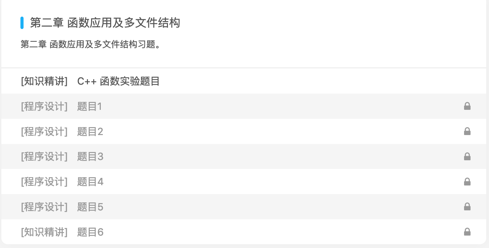

# 3月工作总结

## 本月工作总结
 3月份的工作时间，回顾本月的工作，让我在各方面得到了锻炼，我将主要从C++课程助理，系统平台课程助教，三江源数据中心的运维三个方面做本月工作的总结。

### C++课程助理

#### 课程内容
本月中前三周的实验设计内容主要包含以下三部分内容，分为三次实验课进行。

- 函数设计
	- 函数重载
	- 默认参数
- 指针与数组
	- 指针数组
	- 数组指针
	- 使用指针与数组进行实际操作
- 多文件分离写法
 
#### 实验形式
针对每部分实验内容，有针对性地出了有关知识点的题目，使18级同学能够有效地掌握C++编程的基本思想，培养用编程语言解决实际问题的能力。

##### 实验平台
每次实验每周设计6道题目，采用[计蒜客平台](https://www.jisuanke.com/)进行在线评测，将题目放到C++程序设计班级课程中。

##### 评测模式

当点开每次实验后，可以触发每次的实验内容，同时通过左侧的题面与右侧的终端程序进行测评，必须通过每个案例时才能继续学习。

每道题目包含5-10个测试用例，难度循序渐进，防止题目难度跳跃度过高，新生在学习C++课程编程时难以理解和接受。

##### 实验内容

每次实验约覆盖3-5个知识点，以函数知识点为例，主要包含以下几部分。

函数是一组一起执行一个任务的语句。每个 C++ 程序都至少有一个函数，即主函数 main() ，所有简单的程序都可以定义其他额外的函数。可以将代码划分到不同的函数中。如何划分代码到不同的函数中是可以决定的，但在逻辑上，划分通常是根据每个函数执行一个特定的任务来进行的。

函数声明告诉编译器函数的名称、返回类型和参数。函数定义提供了函数的实际主体。

**定义函数** 

C++ 中的函数定义的一般形式如下：
	
	return_type function_name( parameter list )
	{
   		body of the function
	}
	
每道题目均有类似的5-10个测试用例，难度区分度较大，能够充分锻炼18级学生的编程思维能力。

对于每道题目包含如下的多级的结构:
  
  - 题目描述
  - 输入/输出格式
  - 标准程序（code.cpp)
  - 测试数据 (5-10组)

##### 实验说明
如果编程不易实现的话，会采用文件说明的方式模拟实验，让学生脱离计蒜客平台也能更好的实现知识点，以C++中多文件分离为例.

###### 多文件接口分离
在面向对象的开发过程中，往往把类的声明（其中包括成员函数的声明）放在指定的头文件中。用户如果想要使用该类，只要把有关的头文件包含进来即可。包含成员函数定义的文件就是类的实现。

一个C++程序是由3部分组成的：

  - 类声明的头文件（后缀为.h或无后缀）
  - 类实现文件（后缀为.cpp） 包括类成员函数的定义 
  - 类的使用文件（后缀为.cpp) 即主文件

举例如下：

**类声明的头文件**

	//student.h

	#include<string>
	using namespace std;
	class Student
	{
	public:
		void display();
		Student();
	private:
		int num;
		string name;
		char sex;
	};

**包含类的成员函数的定义的文件（即类实现文件）**

	//student.cpp
		#include<iostream>
		#include<string>
		#include"Sudent.h"
		void Student::display()
		{
			cout<<"num:"<<num<<endl;
			cout<<"name:"<<name<<endl;
			cout<<"sex:"<<sex<<endl;
		}
		Student::Student()
		{
			num=1;
			name="haollo";
			sex='w';
		}

**主文件**

		//main.cpp
		#include<iostream>
		#include"Sudent.h"
		using namespace std;
		int main()
		{
			Student stud;
			stud.display();
			return 0;
		}

在预编译时会把头文件`student.h`中的内容取代`#include "student.h"`行。注意，文件名使用“ ”，而不是尖括号。

这将组成两个文件模块，一个是`main.cpp`,一个是`student.cpp`,C++编译系统对两个源文件分别进行编译，得到两个目标程序`main.obj`和`student.obj`，然后将他们和其他系统资源连接起来，形成可执行文件`main.exe`.

#### 课程辅导
在每周四下午七八节担任课程助教的任务，为18级学生答疑，主要在321机房，若其他班级的学生对所出的计蒜客的题目存疑，会在不同班级间流动进行解答。

#### 总结
本月共出了类似3次实验，共16道题目，约110个用例，能够方便系内18级同学更好的夯实基础，熟悉内容。将代码上传到github上，链接地址如下：

[https://github.com/pqy000/C-2019/tree/master/Jia](https://github.com/pqy000/C-2019/tree/master/Jia)

### 系统平台课程助教
系统平台课程承担作业批改与实验课答疑的工作。

#### 实验课答疑

| 类型 | 内容 |
| :------| :------: 
| 答疑时间 | 周二下午78节 | 
| 答疑班级 | 171 172班 |
| 学生人次 | 80人 |
| 答疑内容1 | TEC2000试验箱的开机与运行 |
| 答疑内容2 | 机箱开机与CPU内存各个组件的观察与安装 |
| 答疑内容3 | 基于TEC2000试验箱编写运行进制转换等应用程序 |
| 答疑内容4 | 监控程序与汇编程序设计|
| 实验课地点  | 系310与309机房 |

##### 实验课形式
通过3-4次的实验课，同学们询问问题积极，营造了良性的问答氛围，能够有效地提高系统对于计算机系统的基础的更深的理解

#### 作业批改
通过[作业在线批改与相似度检验系统](http://49.209.80.36/zytj_published/Teacher/Mains.aspx)，共批改171与172班前两次作业，实验一硬件和实验二监控程序与汇编程序设计，批改分数的与给定评语

### 三江源数据中心运维

在系内提出需要整合和理清三江源数据中心的要求后，在对资料进行整理，拟将数据节点与对应的软件运行环境进行初步的整理，目前还未与基础部老师交流，希望交流后，能通过在具体项目执行过程中遇到的问题来对软硬件环境进行初步的整合，更好地推进三江源数据中心的运维。

## 总结与未来计划

承担助教有关的工作至今已有一月了，在C++课程组与系统平台课程组的各位老师帮助指导下，通过自身努力，从初步承担课程助教工作到熟悉工作，逐渐摸清了工作中的基本状况。

### 存在问题
目前还存在一些问题:

- 实验出的难度还需要控制合适的难度
  - 比如在最近的指针实验卡中，所出实验题目针对字符串与指针操作，以字符串倒置为例，上课进度中可能还未涉及到两者结合，重新修改为整形数数组的倒置，应控制合适的难度，与理论课进度统一

- 实验平台的兼容问题
  - 在使用计蒜客平台时，存在一定的平台兼容问题，比如在本机测试linux与macos中格式均可，但到了计蒜客平台上可能会出现字符乱码的问题，以及测试用例不支持的问题，多次与计蒜客官方客服联系，双方协调，解决了大多数平台兼容中遇到的问题
 
- 作业批改分数控制
	- 在作业批改过程中，对分数需要有效控制，因为在实际过程中感觉批改过于严格，导致大多数分数较低，应考虑到在实验过程中2-3个学生为一组实验，报告中存在或多或少的相似也可以理解，以及应更多的发现学生报告中的亮点，不可过于严苛，导致分数偏低。

### 未来工作计划

在下个月的助教工作中，我各方面的工作时间间节点如下:

- 继续执行助教工作并认真出好17与18级年级的实验课助教的工作，向各位老师的上课过程学习，再接再厉，在细节上提高教学水平
- 加速对三江源数据中心运维工作的推进工作

| 类型 | 时间节点 | 教学内容 |
| ------ | ------ | ------ |
| C++课程助教 | 2018.04每周 | 指针实验  实现一个简单的数组类 实现一个简单的学生类 |
| C++计蒜客平台维护 | 每周题目与测试用例 | 指针 数组 面向对象设计 |
| 系统平台助教 | 2018.04每周 | 汇编程序设计与作业批改 |
| 三江源数据分析中心运维 | 根据项目需求 | 集群运维的初步方案培训与整理 |

### 心得体会

综上所述，我对接下来的工作做一个初步规划:

首先在担任C++的助教工作中，不骄傲不自满，随时学习网上课程随时充实自己，教学合一。希望通过在学习mooc(C++程序设计基础)中，借鉴网上老师的教学方式，快捷有效地教授内容。以一个谦虚的自己面对以后的助教工作学习生活。勤于思考，完善自我。“学而不思则罔，思而不学则殆”，在今后的课程助理的工作学习中要勤于思考，经过不断思考，明辨是非，有不足，则改之，无，则笃行。

再次，我要做到更好地与老师和同学们交流合作，不论是自己教学工作还是实验卡的设计工作或者是课程答疑中，在合作中与各位老师形成更好的合作默契，追求更高的教学效率。现在可能还存在一些教学方法不到位的现象，比如在为指针创建新空间的时候，应当用动画让学生感性地认识到使用指针的便利。“三人行，必有我师，择其善者而从之，其不善者而改之”，下一步工作中我应当注意更好地合作，以求良好教学效果。

最后，勇于任事，提高能力。“知者不惑，仁者不忧，勇者不惧”，在任何时候，做任何事，都要全心全力，认真负责，无论是系内交代的具体的任务工作，不接则已，接了就要全心全责，以整个心去做事，才能做到更好更优秀。

以上就是我对自己一个月来的工作所做的新的心得总结，无论工作怎样，都要认真对待，细心完成，工作重而多，要不气馁不抱怨，工作少而精，要不焦躁并有足够的耐心。只要有好的心态，进而有更高的教学效率。在以后的工作中，我一定还会学到更多的教学方面有关的经验与承担更多的课程任务，会有更多的心得和体会。

工作中虽然取得了一定的进步，但仍然存在着一些问题和不足，今后我要一如即往的向各位老师学习，发扬优点，克服不足，与时俱进，用心进取，以系内工作为首要，力争使自己的专业素质和教学业务水平在较短时间内容再上新台阶。

## 致谢

贾金芳老师针对在我出实验内容所出题目的一些细节错误，让我得到及时地改正，杨老师在我的班级实验助教工作中，让我尝试讲解实验课程内容，锻炼我的表达能力，有效地教授实验课内容，刘主任为我的助教工作的进展提供了很大的帮助，让我与课程组的老师能够消除陌生感，更好的融入集体进行课程助理工作，在各位老师的帮助下，我本身的业务素质和助教工作方面的潜力得到了很大的提高。

 

 
	
	
